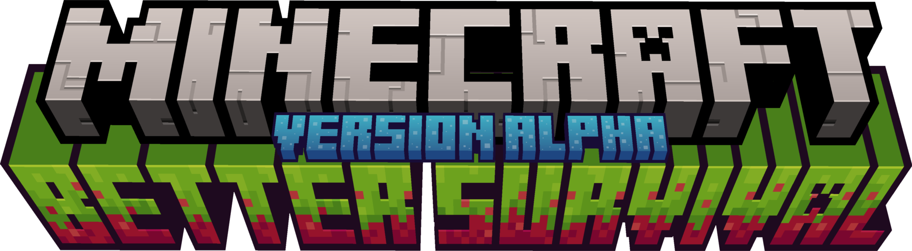

# Better Survival Plugin

Better Survival is a Java Spigot plugin designed to enhance the multiplayer survival experience on your server. It introduces new features such as private and public plots and player-owned shops, allowing players to sell their items even when they are offline. The plugin utilizes a custom in-game currency called BSbucks, which can be used to purchase plots.

## Features

- Create and manage private or public plots.
- Establish player-owned shops for item trading.
- Introduces BSbucks as an in-game currency.
- Daily login rewards.
- Unstuck command (/stuck) to resolve any gameplay issues.

## Installation

1. Download the latest version of Better Survival from the [official GitHub repository](https://github.com/LouisBillaut).
2. Place the plugin JAR file into the `plugins` directory of your Spigot server.
3. Restart or reload the server.

## Usage

### Commands

- `/plot <new|list> [name]`: Create or list plots.
- `/shop <claim|new|list|add|trade>`: Create or list shops.
- `/bs <buy|show>`: Access Better Survival Bucks features.
- `/stuck`: Unstuck your character.

### Plot Command

- `/plot new <name>`: Create a new plot.
- `/plot list`: List active plots.

### Shop Command

- `/shop claim <list|get>`: Manage shop claims.
- `/shop show <name>`: Show a specific shop.
- `/shop new <name>`: Create a new shop.
- `/shop list [all]`: List available shops.
- `/shop add <name> <itemID> <quantity>`: Add an item to a shop.
- `/shop trade <shop name> [new]`: Perform trade actions with a shop.

### BS Command

- `/bs buy`: Open the BS Bucks inventory.
- `/bs show`: Show the player's BS Bucks balance.

## Daily Rewards

By logging in daily, you can earn various rewards. Here's what you can expect:

- First login reward: 30,000 BSbucks.